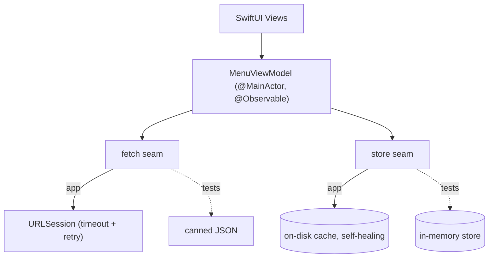

# Little Lemon (iOS)

The iOS build of the Little Lemon capstone: sign up, browse a live menu, and filter or search it — in English or French. Also built for [web](https://github.com/A-bv/Capstone-react) and [React Native](https://github.com/A-bv/Capstone-react-native).

[](https://github.com/A-bv/Capstone-iOS/actions/workflows/ci.yml)


[](LICENSE)

<p align="center">
  
</p>

The menu is fetched from an API and cached on device with Core Data, so it loads instantly and works offline. Accounts persist across launches, the menu filters by category and searches live, and the interface is fully localized in English and French.

## Engineering

Built to a senior iOS bar — modern, resilient, and tested.

**Modern Swift & concurrency**
- Swift 6 language mode (strict concurrency), clean.
- The view model is `@MainActor`-isolated; networking is structured `async/await`.
- The in-flight download cancels when the screen disappears, and a transient error retries once behind a 15-second request timeout.

**Architecture & testability**
- MVVM with the `@Observable` macro and one source of truth for the menu and its filter state.
- **Deliberately pragmatic, not Clean Architecture.** There's no separate domain layer or repository ceremony — a single-feature menu app doesn't earn that boilerplate. Instead the view model depends on two **injectable seams**: a `(URL) async throws -> Data` fetch closure and a Core Data store. That buys full testability without the file-multiplying overhead of full Clean Arch.
- Every unit test runs against canned data and an in-memory store — no simulator, no network.

**Production quality**
- The on-device cache **self-heals**: a corrupt or un-migratable store is logged, destroyed, and rebuilt, because the menu is re-downloadable.
- A privacy manifest declares the one required-reason API (`UserDefaults`); failures go through `os.Logger`.
- Selection and success haptics, animated filtering, and a shared spacing/radius scale instead of per-view magic numbers.

**Accessibility & localization**
- VoiceOver labels and traits, menu and profile rows grouped into single elements, decorative images hidden.
- Dynamic Type to the largest accessibility sizes, with a header that grows instead of clipping.
- Full English and French through a String Catalog, including the data-driven category names.

**Tests & tooling**
- Unit tests cover the view-model logic, JSON decoding, load cancellation, and the retry — and a re-entrant "load twice" bug is pinned by a negative control — plus a UI test that walks sign-up → menu → profile.
- GitHub Actions builds and runs all of it on every push.

## Architecture

Pragmatic, main-actor MVVM. SwiftUI views observe a `@MainActor @Observable` view model that owns the menu and filter state. Rather than reach for concrete singletons, the view model depends on two injectable seams — so it's fully testable and the network/persistence choices stay swappable. Login state lives in `@AppStorage` at the app root, which swaps between onboarding and the tab bar.



## Build & run

```bash
git clone https://github.com/A-bv/Capstone-iOS.git
cd Capstone-iOS
open Restaurant/Restaurant.xcodeproj
```

Select an iOS 17.2+ simulator (or a device) and press **⌘R**.

## Tests

```bash
xcodebuild test -scheme Restaurant \
  -destination 'platform=iOS Simulator,name=iPhone 17 Pro'
```

Unit tests live in `RestaurantTests`, the UI test in `RestaurantUITests`; both run on CI.

## Author

Built by [A-bv](https://github.com/A-bv).

## License

MIT — see [LICENSE](LICENSE).
