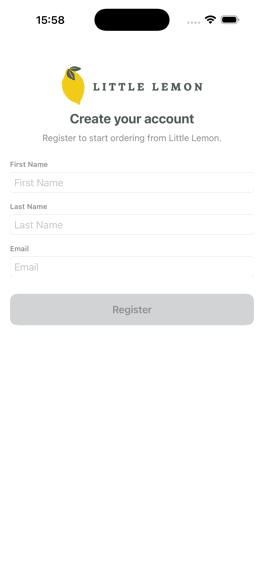
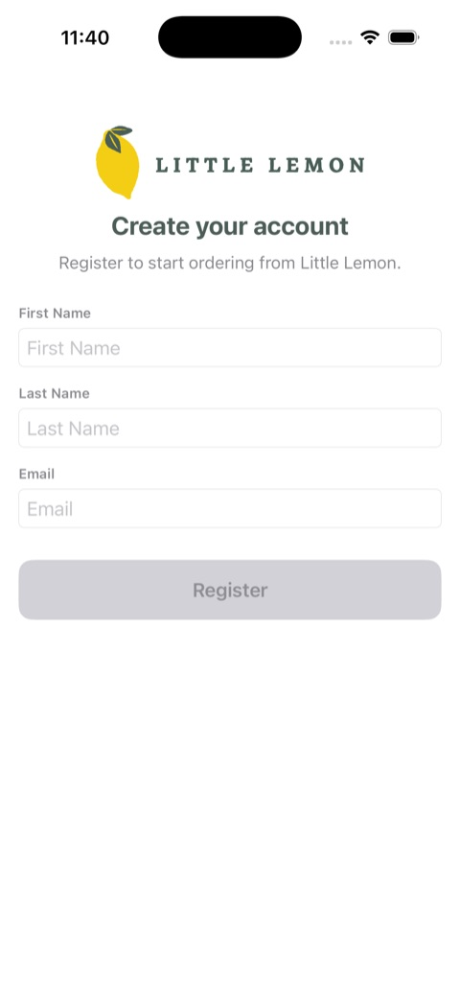
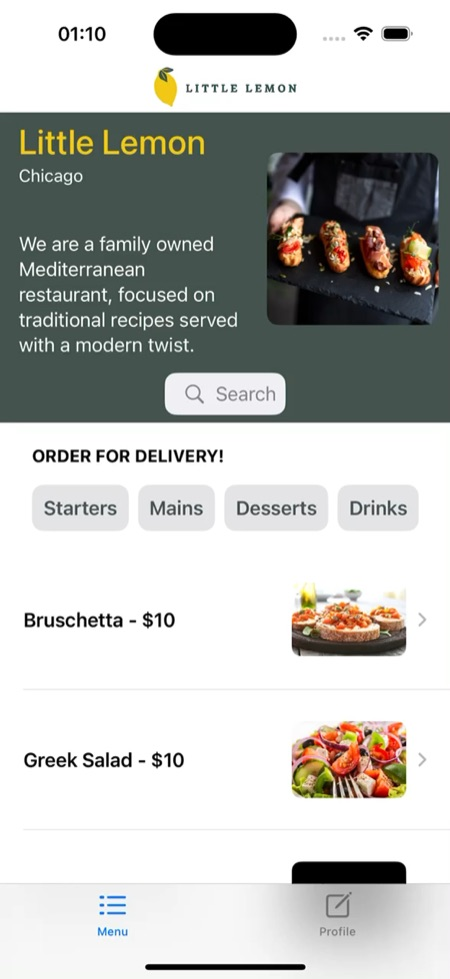

# Little Lemon App

[](https://github.com/A-bv/Capstone-iOS/actions/workflows/ci.yml)    [](LICENSE)

A modern restaurant app built using SwiftUI.

## Preview

<p align="center">
  
</p>

## Screenshots

| Sign up | Menu |
| :--: | :--: |
|  |  |

## Features

- **Account Creation and Persistence:** 
  - Users can create an account.
  - The app retains the login status (logged in or logged out).

- **Menu Selection:**
  - The menu is fetched from an API.
  - A search bar allows users to filter the menu items.

## Requirements

- iOS 17.2 or later
- Xcode 16 or later
- Swift 6

## Installation

To get started with the Little Lemon App, follow these steps:

1. **Clone the Repository:**

    ```bash
    git clone https://github.com/A-bv/Capstone-iOS.git
    ```

2. **Navigate to the Project Directory:**

    ```bash
    cd Capstone-iOS
    ```

3. **Open in Xcode:**

    Open the `Restaurant/Restaurant.xcodeproj` file in Xcode.

4. **Build and Run:**

    Select the appropriate simulator or connected device and press the `Run` button in Xcode.

## Usage

Once the app is running, you can:

- **Create an Account:** Register a new account and the app will remember your login status.
- **Browse the Menu:** Explore the restaurant's menu items fetched from an API.
- **Search for Items:** Use the search bar to filter menu items based on your input.

## Contributing

Contributions to the Little Lemon App are welcome! If you would like to contribute, please follow these guidelines:

1. **Fork the Repository**
2. **Create a New Branch**

    ```bash
    git checkout -b feature/your-feature
    ```

3. **Make Your Changes**
4. **Commit Your Changes**

    ```bash
    git commit -am 'Add new feature'
    ```

5. **Push to the Branch**

    ```bash
    git push origin feature/your-feature
    ```

6. **Create a Pull Request**

    Submit a pull request detailing your changes and any relevant information.

## License

This project is licensed under the MIT License - see the [LICENSE](LICENSE) file for details.

## Acknowledgments

- [SwiftUI](https://developer.apple.com/xcode/swiftui/) - A framework to build user interfaces across all Apple platforms.
- [Core Data](https://developer.apple.com/documentation/coredata) - Used to cache the fetched menu on device for offline access.

## Additional resources

Wireframes: Two wireframes are available in the repository and can be opened with Figma.
